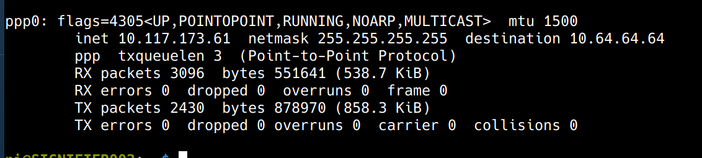

# Sim card install script

This script installs the configuration files needed to connect to the internet with the sim7000e modem connected over usb on ttyUSB2

it also installs a system service which can be enabled once the connection has been verified.

## installation

clone this repo

```git clone https://github.com/MMW2021/sim-cards.git```

run the install script

```sudo sh sim-cards/sig_sim_install.sh```

Once the conf files are installed, run
```bash
sudo pppd call gprs
```
to test.

If the connection was successful, a new interface will be registered by pppd.


